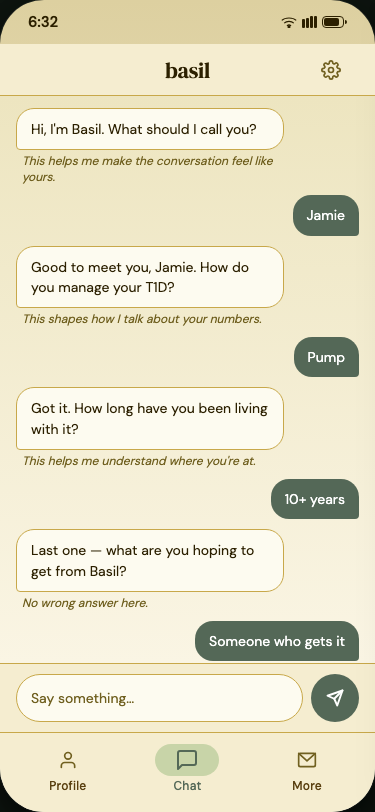
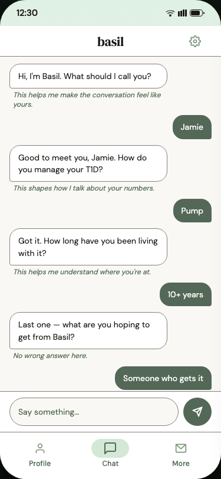
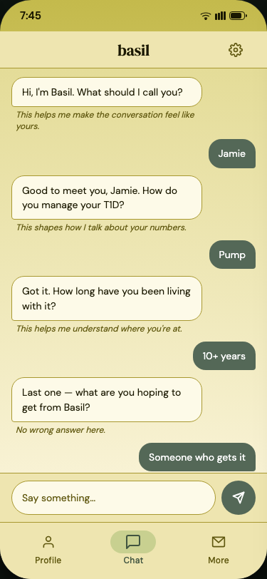
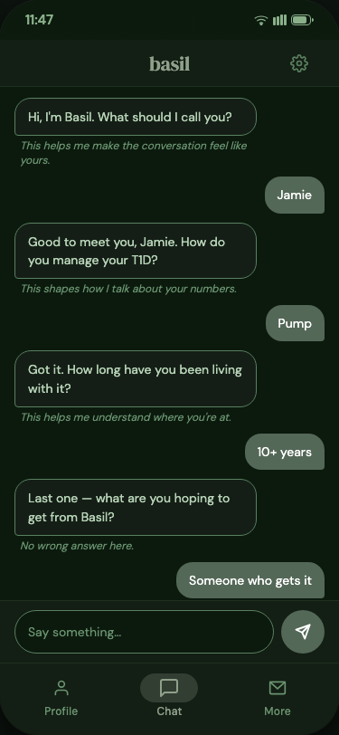

← [Back to README](../../README.md)

# Chapter: The Basil Theme

The day/night cycle is core to Basil's identity — not a theme setting, not dark mode. It's always on. Color, tone, and lighting shift through four periods of the day, and the app is meant to feel alive because it responds to the actual moment the user is in, not a generic session state.

<table>
  <tr>
    <td align="center"><br/><sub>Morning · 6:32</sub></td>
    <td align="center"><br/><sub>Day · 12:30</sub></td>
    <td align="center"><br/><sub>Evening · 7:45</sub></td>
    <td align="center"><br/><sub>Night · 11:47</sub></td>
  </tr>
</table>

## The color system

Every color in the app traces back to one seed: a sage-green hue (`130°`, chroma `0.22`), expanded into a 10-stop tonal palette (`shade50`–`shade900`) by [`basilTonalPalette()`](../../composeApp/src/commonMain/kotlin/org/weekendware/basil/presentation/theme/BasilColors.kt). Change the seed hue or chroma and every derived color across the entire app updates automatically — nothing is hand-picked shade by shade.

From that one palette, four time-of-day schemes are built:

| Time slot | Hours | Character |
|---|---|---|
| Morning | 5–9 | Wheat-gold warm palette |
| Day | 10–17 | Barely-green wash to cream |
| Evening | 18–20 | Olive-gold palette |
| Night | 21–4 | Deep forest |

### Dark mode is a second, independent axis

Phone-level dark mode and the day/night cycle don't collapse into each other — they're orthogonal. Each of the four time slots has its own light *and* dark variant (`basilMorningColorScheme()` / `basilMorningDarkColorScheme()`, and so on for day/evening/night), for **8 schemes total**. A user at noon with system dark mode on still sees a midday-quality palette — just dark. The cycle never flattens to "always night" just because dark mode is on.

`basilSchemeForHour(hour, isDark)` resolves the correct one of the 8 for the current clock hour and system theme setting.

### Transitions

Scheme changes animate over 10 seconds rather than cutting instantly, driven by a background `viewModelScope` coroutine in `BasilThemeViewModel` — the correct scheme is already resolved and in place before the user foregrounds the app, so there's never a visible flash on cold start.

## Typography

Two typefaces, used deliberately, not interchangeably:

- **DM Sans** (`dmSansFamily()`) — every UI element: labels, body text, buttons, field values.
- **DM Serif Display** (`dmSerifDisplayFamily()`) — reserved for the "basil" wordmark and editorial headings ("Welcome back," "Reset your password," the onboarding conversation). This is the one deliberate brand flourish in an otherwise plain, functional type scale — see [`BasilTypography.kt`](../../composeApp/src/commonMain/kotlin/org/weekendware/basil/presentation/theme/BasilTypography.kt) for the full scale and which style to reach for where.

A real mockup-fidelity bug shipped and got caught mid-build this session: several auth screens were using the generic Material `headlineSmall` (sans-serif, bold) instead of the mockup's specified serif/regular heading treatment, and the hero wordmark was rendering 43% larger than designed. Fixed by adding dedicated `authHeadingStyle()`/`authHeroWordmarkStyle()` tokens rather than continuing to reach for the wrong shared ones — worth knowing about if you're extending auth-family screens, since the generic Material roles are *not* the right default there.

## Where this lives in code

```
presentation/theme/
├── BasilColors.kt       8 color schemes + the tonal palette generator
├── BasilTypography.kt   DM Sans / DM Serif Display type scale
├── BasilTokens.kt       spacing, corner radii, component sizing (e.g. AuthFieldHeight = 52dp)
└── BasilTheme.kt        wires it all into MaterialTheme, picks the scheme for the current hour
```

← [Back to README](../../README.md) · Next: [Auth →](auth.md)
