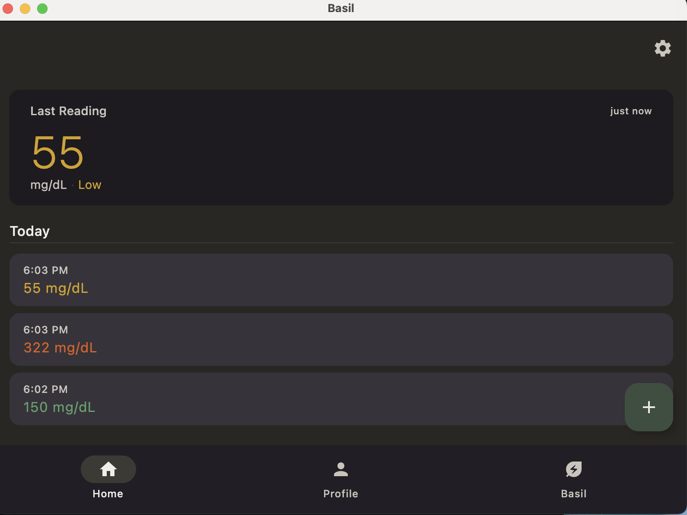
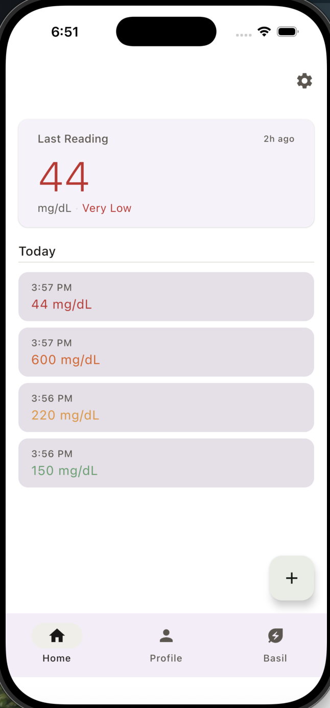
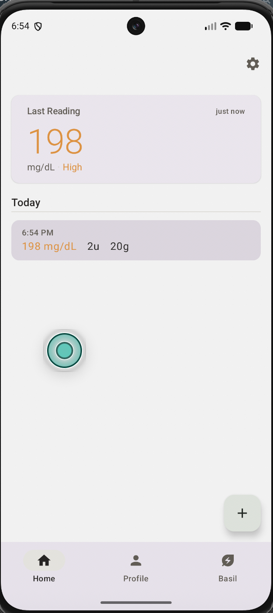

# Basil – Type 1 Diabetes Management
*Built by WeekendWare*

Basil is a Kotlin Multiplatform app for managing life with Type 1 diabetes. One codebase, three targets — Android, iOS, and desktop — built with Compose Multiplatform and a clean layered architecture.

---

## Screenshots

| Desktop | iOS | Android |
|:---:|:---:|:---:|
|  |  |  |

---

## Engineering

### Stack

| Concern | Library |
|---|---|
| UI | Compose Multiplatform 1.8.1 |
| Navigation | Compose Multiplatform Navigation 2.8.0-alpha13 |
| ViewModel | androidx.lifecycle 2.9.0 |
| DI | Koin 4.0.4 |
| Database | SQLDelight 2.0.1 |
| Date/Time | kotlinx-datetime 0.6.0 |
| Static analysis | Detekt 1.23.7 + detekt-formatting |
| Testing | kotlin-test + Mockito-Kotlin 5.4.0 |

### Architecture

```
presentation/          Compose UI + ViewModels (MVVM)
domain/model/          Pure Kotlin domain models
domain/usecase/        Single-responsibility use cases
data/repository/       Repository interfaces + SQLDelight implementations
data/local/database/   SQLDelight schema, queries, DatabaseDriverFactory
di/                    Koin modules — shared + platform-specific
```

Each layer depends only on the layer below it. ViewModels and use cases depend on repository *interfaces*, keeping them testable without a real database. ViewModels extend `androidx.lifecycle.ViewModel` and are scoped to their nav destination via `koinViewModel<T>()`.

### What's built

- **Dashboard** — last BG reading card with glucose status colouring, today's entry timeline, empty states
- **Log entry** — bottom sheet for logging BG, insulin, and carbs; BG unit preference persisted across sessions
- **Navigation** — `NavHost`-based navigation with bottom tab bar and settings destination
- **Theme** — custom `BasilColors`, `BasilSpacing`, `BasilTypography`, `BasilShapes` wired into MaterialTheme
- **Data layer** — `LogRepository`, `PreferencesRepository`, `UserRepository` backed by SQLDelight
- **CI/CD** — GitHub Actions running Detekt, Android compile + test, and iOS framework build on every push

---

## Roadmap

- [ ] Build flavors (dev / staging / prod)
- [ ] Supabase auth + user session
- [ ] Profile screen
- [ ] Settings screen (units, notifications, theme)
- [ ] History and trends view
- [ ] AI assistant chat (Basil tab)
- [ ] Sentry crash reporting
- [ ] Push notifications

---

## Running Locally

**Android**
```
./gradlew :composeApp:assembleDebug
```

**Desktop**
```
./gradlew :composeApp:run
```

**iOS** — open `iosApp/iosApp.xcodeproj` in Xcode and run on any iOS 16+ simulator.

**Tests**
```
./gradlew desktopTest
```

**Static analysis**
```
./gradlew detekt
```

---

## License

MIT
